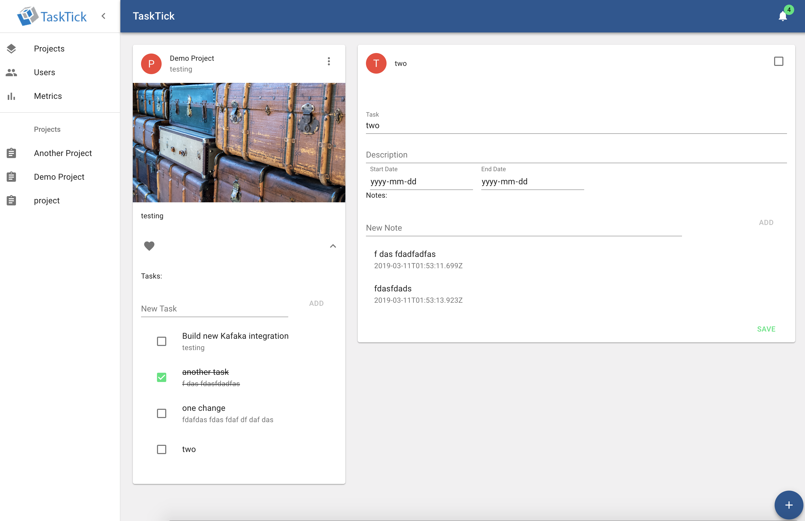

# TaskTick

An example Task Manager project that has been created using Lagom.  
It is fantastic ;)


## Overview
This project goes with my blog post and serves to demo how fast and easy it is to produce a modern progressive web application with Lagom.

Some of the features include:

* React FrontEnd (PWA) that connects to the Lagom backend using a WebSocket connection.
* JWT authentication and Auth management:
    * This includes login and registration
    * Restricting access to routes based on the jwt auth token.
* Publish Events to kafka stream (for a future Notification or other services) 
* Handle OAuth flow to allow for users to connect their github accounts.
* Event Sourced Project and User Entities 

Screen Shot


## How to Run

clone the repository

`git clone git@github.com:coreyauger/tasktick.git`

enter the new directory

`cd tasktick`

compile and run the react front end

```
cd tasktick-pwa
npm i
gult watch
```

change the refrence to where the compiled `www` directory location is in your `application.conf`

```yaml
www{
  base-url = "/Users/coreyauger/projects/tasktick/tasktick-pwa/www"
}
```

enter sbt and use the `runAll`

```
sbt> runAll
```

direct your browser at:

`http://localhost:9000/p/signin`


play!